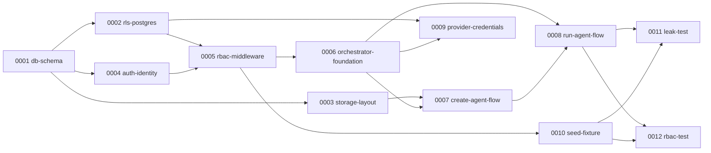

# Workflow — Houston 2.0

> Este Workflow describe **cómo se construye Houston 2.0**. Es un artefacto **derivado del RFC** (`.claude/specs/rfc.md`) por la skill `plan-workflow`. Aprobado en Gate 2 del Bootstrap.
>
> **Artefactos de Bootstrap**: `prd.md` (Gate 1) → `rfc.md` (Gate 2) → **este archivo** (declarante soberano en tiempo de ejecución).

## 1. Granularidad elegida

**1 Task = 1 slice vertical entregable.**

Cada Task produce funcionalidad testeable en aislamiento:
- una migración de base de datos + sus tests RLS,
- un handler Go + sus tests de integración,
- un script + sus fixtures, o
- un test de acceptance que actúa como gate del MVP.

**Justificación**: el MVP tiene capas ortogonales bien definidas (datos → auth → RBAC → flows → tests). Granularidad más gruesa hace los PRs inrevisables; más fina (una tabla por task) no añade valor de aislamiento.

## 2. Declaración POA del Workflow

### 2.1 Agents declarados (11 — factory estándar ya instalada)

| # | Agent | Capa | Color | Rol en Houston 2.0 |
|---|---|---|---|---|
| 1 | `researcher` | Transversal | cyan | Research de stack Go + Supabase por task |
| 2 | `tl` | Cross-cutting | pink | Orquesta el ciclo completo |
| 3 | `planner` | Bootstrap | orange | Usado en este Bootstrap |
| 4 | `curator` | Specify | blue | Pulir What/Why/How por task |
| 5 | `specter` | Specify | blue | Materializar specs |
| 6 | `qa` | Plan | purple | Tests antes de implementar |
| 7 | `coder` | Implement | green | Implementar cada task |
| 8 | `reviewer` | Implement | green | Code review |
| 9 | `tester` | Validate | red | Correr tests |
| 10 | `pr` | Validate | red | Abrir PR |
| 11 | `auditor` | Validate | red | Validar Spec↔Código |

### 2.2 Skills declaradas

| # | Skill | Usada por | `disable-model-invocation` |
|---|---|---|---|
| 1 | `research-topic` | researcher | no |
| 2 | `polish-idea` | curator | no |
| 3 | `write-spec` | specter | sí |
| 4 | `spec-lint` | qa | sí |
| 5 | `author-tests` | qa | sí |
| 6 | `verify-contract` | auditor | sí |

### 2.3 Hooks declarados

| # | Hook | Evento | Bloqueante |
|---|---|---|---|
| 1 | `permissions-guard` | `SessionStart` | warn |
| 2 | `pre-spec-validate` | `PreToolUse(Write)` sobre `specs/tasks/**` | sí (exit 2) |
| 3 | `pre-commit-contract` | git pre-commit | sí (exit 2) |
| 4 | `post-merge-bump` | git post-merge | no (efecto) |

### 2.4 Commands declarados

| # | Command | Use case |
|---|---|---|
| 1 | `/task-run` | UC-2 — ciclo SDD por task |
| 2 | `/spec-new` | Crea esqueleto de Spec |
| 3 | `/spec-bump` | Bumpea versión (Auditor) |
| 4 | `/agent-new` | UC-4 — agregar nuevo agente |

### 2.5 MCPs declarados

**Ninguno.** Supabase vía Go SDK; Claude Code vía subprocess local.

## 3. Lista de Tasks (orden recomendado de implementación)

> El orden respeta dependencias. Empezar desde la capa de datos; los tests de acceptance son el último gate.

### Capa de datos (0001–0003)

- **0001** — `db-schema`: Migraciones Supabase — `organizations`, `groups`, `memberships`, `agents`, `runs`, `org_credentials`. Base de todo lo demás.
- **0002** — `rls-postgres`: Políticas RLS en todas las tablas tenant-scoped + helper `current_tenant()` (security definer). El aislamiento real vive aquí.
- **0003** — `storage-layout`: Bucket structure + Storage RLS + seed del template `sales` en `templates/`. Incluye los prefijos `houston/{org}/{group}/` y `houston/{org}/general/`.

### Auth + RBAC (0004–0005)

- **0004** — `auth-identity`: Supabase project propio + Google SSO PKCE + loopback redirect en Go. No reusa el project de Houston (credenciales baked-in en Tauri).
- **0005** — `rbac-middleware`: Go middleware que deriva `(org_id, group_id, role)` desde `memberships` y hace enforcement 403 por rol. Depende de RLS (0002) y Auth (0004).

### Orquestador (0006)

- **0006** — `orchestrator-foundation`: Go HTTP server, rutas `/v1/*` (shape Houston-compatible), request context propagation, structured logging. Base de todos los handlers.

### Flows (0007–0009)

- **0007** — `create-agent-flow`: `POST /v1/agents` con 4 fuentes (blank, template, ai-assist, github). Escribe fila en `agents` + objetos en Storage.
- **0008** — `run-agent-flow`: `POST /v1/agents/{id}/runs` — gather context (Storage RLS), Claude Code subprocess, workspace aislado por run (`/tmp/houston-run-{uuid}/`), API key inyectada. Soporta concurrencia.
- **0009** — `provider-credentials`: CRUD `/v1/orgs/{id}/credentials` — registrar, rotar y validar API key de Anthropic por org. Solo `org:owner`. Key cifrada en `org_credentials`.

### Fixtures + Tests de acceptance (0010–0012)

- **0010** — `seed-fixture`: Script reproducible que crea 2 orgs / 2 grupos / 3 usuarios / 3 roles + helpers para tests. Gate previo a los acceptance tests.
- **0011** — `leak-test`: **Acceptance gate MVP**. Actuar como Usuario A (Org 1 / Grupo 1); afirmar que 0 rows y 0 objetos de Storage de Org 2 o de Org 1/Grupo 2 son retornados. EXIT 0 = aislamiento íntegro.
- **0012** — `rbac-test`: **Acceptance gate MVP**. Ejecutar operaciones fuera de rol para cada combinación; afirmar que todas retornan 403.

## 4. Dependencias entre Tasks (grafo)

## 5. Definition of Done por Task

Una Task se considera completa cuando:

1. Su Spec existe en `.claude/specs/tasks/<id>-<slug>.md` con What/Why/How y acceptance criteria explícitos.
2. Sus tests (unit/integration/acceptance según aplique) existen en `tests/<level>/<id>__<slug>.test.*` y pasan.
3. El artefacto correspondiente (migración, handler Go, script) está en su path canónico.
4. `Auditor` aprobó el PR y `Spec.version` quedó bumpeada.

## 6. Riesgos identificados

- **R1 — RLS misconfiguration**: si una policy está mal escrita, el leak test falla. Gate automático.
- **R2 — `current_tenant()` multi-membership**: un usuario en múltiples grupos → `LIMIT 1` en MVP. Multi-group es post-MVP.
- **R3 — Claude Code CLI breaking change**: detectado en tests de integración de Task 0008. Pin de versión.
- **R4 — Config Google OAuth desde cero**: proceso bien documentado en GCP Console + Supabase Auth. Riesgo bajo.

## 7. Out of scope para este Workflow

- WebSocket / streaming (HTTP-only en MVP).
- Cloud hosting, sandboxes efímeros (local solamente).
- RAG / pgvector (full-context en MVP, deuda técnica aceptada).
- BYOA OAuth relay completo (API key en MVP, relay post-MVP).
- UI (demo vía curl y scripts).
- Sharing controlado entre grupos/orgs (`context_shares`).
