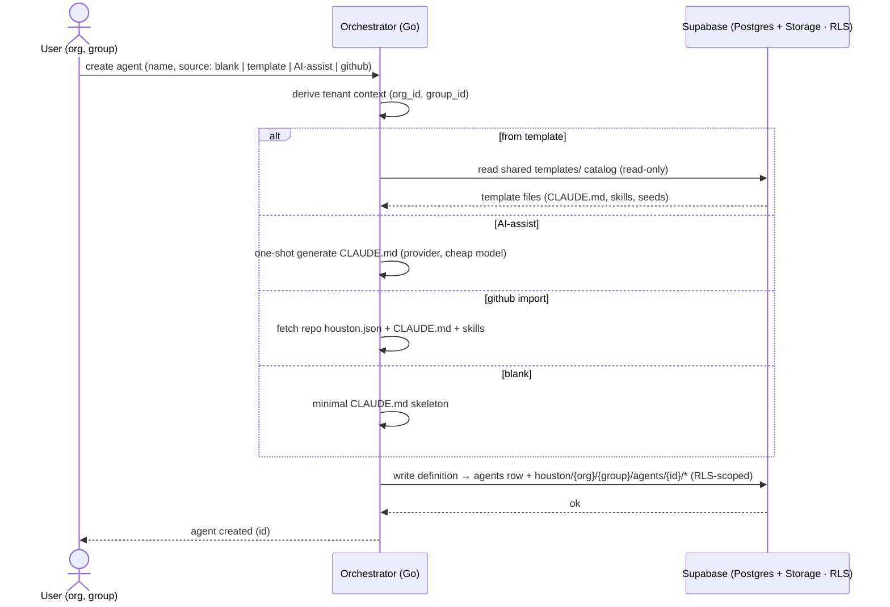
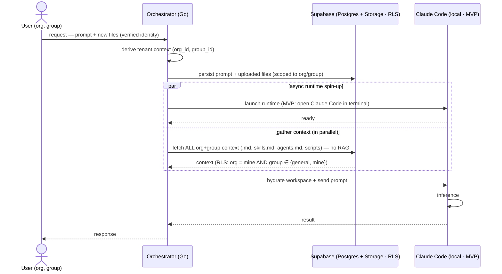

# Houston 2.0 — Design (HOW)

> `README.md` describes **what** we are building and **why**. This document describes **how**.
> It is **MVP-focused**: the spine (§1–§5) is the isolation-demo MVP we are building now. The
> broader exploration — runtime options, hosting candidates, billing, full agent lifecycle —
> is preserved in the **Appendix** (post-MVP).

---

## 1. Purpose & relationship to the README

The README is the *what/why*; this is the *how*. The MVP's job is to **prove data isolation**
between users, organizations, and groups, and to show how the flow generalizes to N orgs / N
groups / N users.

**MVP shape (decided):** no VPS, runs **local**; a **Go orchestrator**; **Supabase** as the
data layer (**Postgres + RLS** for identity/agents/prompts, **Storage buckets + RLS** for
agent files); and **Claude Code in the local terminal** as the runtime. No semantic
search/RAG yet — the orchestrator gathers and sends *all* of a tenant's org+group context.

**MVP scope:** 3 users · 2 organizations · 2 groups.

Everything about cloud hosting, ephemeral sandboxes, billing, and the full hydrate/sync agent
lifecycle is **deferred to the Appendix**.

---

## 2. MVP use cases & flows (the spine)

Two tenant-isolated use cases, both in the MVP: **(a) create an agent** and **(b) run an agent
(request → inference)**. Shared MVP simplifications:

- **Runtime** = Go orchestrator opening **Claude Code in the local terminal** (subprocess),
  launched **asynchronously**.
- **Storage** = Supabase **Storage buckets + RLS** for agent files; **Postgres + RLS** for
  identity, agents, and prompts.
- **No RAG** — gather and send *all* org+group context.
- **Scope** 3 users / 2 orgs / 2 groups; **goal** = prove isolation + show N-generalization.

### 2.1 Agent creation (write path)

As in v1, the creation paths converge on one thing — **persist an agent definition to
Supabase, scoped to org/group** (an `agents` row + objects under
`houston/{org_id}/{group_id}/agents/{agent_id}/`). The MVP supports the v1 sources: **blank**,
**from template** (the shared catalog, §3), **AI-assist** (one-shot `CLAUDE.md` generation via
the provider), and **GitHub import** (fetch a repo's `houston.json` + files). The created
agent is **tenant-isolated from birth**.



### 2.2 Run an agent (request → inference)

The detailed async flow. MVP simplifications above apply.



> The `par … and … end` block is what "async" means here: the orchestrator does **not** block
> on the (slow) runtime boot — it launches Claude Code and, in parallel, fetches the org+group
> context from Supabase. Only when both branches complete does it send the prompt.

---

## 3. Data model & isolation (MVP)

Supabase is where the README's *"isolation enforced by the data layer"* becomes concrete.

**Postgres tables** (every tenant row carries `org_id` + `group_id`):

- `organizations` — the tenant / unit of isolation.
- `groups` — subdivisions of an org, including a special `general` group per org.
- `memberships` — `user → org + group (+ role)`; the source of a request's tenant context.
- `agents` — the agent definition records (id, name, config, `org_id`, `group_id`).
- `prompts` / `conversations` — request + interaction history.

**RLS** is keyed on the requesting user's membership (org_id/group_id read from the JWT claims
or via a `security definer` helper), enforcing the README's central rule:

```
org = mine  AND  group ∈ { general, mine }
```

Even a malformed query cannot return another org's rows — RLS filters before results return.

**Storage bucket layout** — agent files live in buckets under per-tenant path prefixes:

```
houston/{org_id}/{group_id}/agents/{agent_id}/...   ← group-scoped agent files
houston/{org_id}/general/...                         ← org-wide (general) layer
templates/...                                        ← shared catalog (NOT tenant-scoped)
```

**Storage RLS policies** mirror the same `org = mine AND group ∈ {general, mine}` rule for the
tenant prefixes.

**Templates / store (shared catalog).** The original repo's bundled agent templates (e.g. a
`sales`/`ventas` agent) live in Supabase as a **global, read-only catalog** — a `templates`
table + a `templates/` bucket prefix that is **not** tenant-scoped (read by everyone).
**Instantiating** a template **copies** its files (`CLAUDE.md`, skills, seeds) into the
requesting org/group prefix, where it becomes a normal tenant-isolated agent.
**Isolation nuance:** templates are shared read-only; agent *instances* are org/group-scoped.
The MVP seeds at least one template (e.g. sales) to demonstrate this.

**The leak test (acceptance gate).** Seed 2 orgs / 2 groups / 3 users; act as User A
(Org1/Group1); assert that **no rows and no bucket objects** from Org2 or from Org1/Group2 are
returned (the `general` layer of the user's own org excepted). This test failing = isolation
broke.

---

## 4. Context hydration (MVP)

How the orchestrator assembles what Claude Code receives:

1. List + download **all** objects under the tenant's bucket prefixes — the user's group
   (`houston/{org}/{group}/...`) plus the org's `general` layer (`houston/{org}/general/...`).
2. Drop them into the Claude Code working directory (`.md`, `skills.md`, `agents.md`, scripts,
   json — the same file shapes v1 uses).
3. Send the prompt.

**MVP = send everything** — no selection, no embeddings, no semantic search. (Retrieval
optimization with pgvector is post-MVP; see Appendix D/E.)

Creating an agent **from a template** copies the shared `templates/` files into the tenant
prefix first (§3); from then on hydration reads only the tenant's own org/group objects.

---

## 5. Local dev / running the MVP

What it takes to run the MVP locally:

- The **Go orchestrator** process (REST entrypoint for create-agent and run-agent).
- The **`claude` CLI** installed and authenticated (the local runtime).
- **Supabase** — local CLI or a cloud project — with the schema, buckets, and **RLS policies**
  applied, plus the `templates` catalog seeded.
- **Seed fixture** — the 2-org / 2-group / 3-user data used by the leak test.

There is no cloud/sandbox provisioning in the MVP: "spin up the machine" = open Claude Code in
a local terminal.

---

# Appendix — Post-MVP / exploration

> The MVP fixes two things deliberately: **runtime = local Claude Code** and **storage = Supabase
> buckets**. This appendix records the longer-term options and the research behind them. They
> are **not** part of the MVP.

## A. Runtime options (not yet decided for post-MVP)

How the agent loop runs once we leave the local terminal.

- **Option A — Claude Agent SDK (headless).** Same agentic loop/tools as Claude Code, run
  non-interactively (`-p` / `query()`). **Cross-host fact:** persist
  `~/.claude/projects/<encoded-cwd>/<session-id>.jsonl` and restore it before `resume` →
  `~/.claude` becomes a hydrated artifact stored in Supabase. Best for Claude-native behavior
  with least custom plumbing. Docs: code.claude.com/docs/en/headless,
  platform.claude.com/docs/en/agent-sdk/{sessions,hosting}.
- **Option B — Vercel AI SDK (Agent abstraction).** TypeScript, Claude as a provider, strong
  frontend streaming. Best if web-first; lighter agent layer (we own more of the loop).
- **Option C — Go-native loop on the Anthropic Messages API.** Single-language stack, max
  control, but we rebuild tools/skills/memory ourselves.

**Lean:** Option A preserves the stateless-engine model with least plumbing, and the BYOA
billing model (Appendix C) reinforces it (it requires running the provider CLI / Agent SDK to
perform the user's own OAuth; a pure API-key loop, Option C, does not).

## B. Hosting / sandbox candidates (post-MVP, founder's set; not AWS)

| Platform | Isolation | Cold start | Price (≈) | GPU | Scale-to-zero | Notes |
|---|---|---|---|---|---|---|
| **E2B** | Firecracker microVM, dedicated kernel (strongest) | ~150 ms | $0.0504 / vCPU-hr; Hobby $100 credit, 20 concurrent | No | Yes | Strongest per-tenant boundary; large template catalog |
| **Daytona** | Container default; optional Kata/Sysbox ≈ microVM | ~27–90 ms (fastest) | $0.0504 / vCPU-hr | No | Yes | Best when per-turn cold-start latency dominates |
| **Modal** | gVisor | — | ≈ $0.071 / vCPU-hr; 50k+ concurrent | **Yes (in-sandbox)** | Yes | Only option with a GPU *inside* the sandbox |
| **Railway** | Container PaaS | — | per-service | No | No (per service) | Great DX; weaker per-session isolation |
| **Google Cloud — Cloud Run** | gVisor containers, scale-to-zero | — | per-request / CPU | Yes | Yes | GCP-native baseline |
| **Lambda(s)** | — | — | — | depends | — | **Ambiguous:** *AWS Lambda* (excluded) vs *Lambda Labs* (GPU cloud, not a per-session sandbox). Confirm intent. |

**Lean:** E2B for strongest isolation; Daytona if cold-start latency dominates; Modal only if
GPU work happens sandbox-side; Cloud Run as the GCP-native baseline. Figures are May 2026
research — re-verify (pricing drifts).

## C. Provider accounts & billing — Bring Your Own Account (BYOA)

Mirrors how [Houston](https://github.com/gethouston/houston) does it today.

**Principle.** No platform-wide AI API keys, no token reselling. Each org/user **connects
their own provider account** (Anthropic / OpenAI / Google); AI usage is billed by the provider
**directly to that account**. This resolves the README's *cost isolation* question for AI
spend: the billing boundary is the provider account itself, per tenant.

**Two distinct "logins":** (A) **Houston user identity** — Supabase Auth + OAuth (PKCE);
(B) **provider / "service account"** — provider CLI OAuth, orchestrated headless. "Billing
login" = B.

**Headless relay.** The control plane launches the provider CLI as a subprocess (stdin/stdout
piped), reads stdout line-by-line, strips ANSI, extracts the first HTTPS login URL → emits over
WebSocket. The user authorizes and either **pastes back** a code (Claude) or uses a
**device-code** the CLI prints (Codex `--device-auth`). On success the CLI writes its
credentials file; completion is reported over WS.

| Provider | Connect command | Flow | Credentials file |
|---|---|---|---|
| **Anthropic / Claude** | `claude auth login --claudeai` | paste-back | `~/.claude/.credentials.json` |
| **OpenAI / Codex** | `codex login --device-auth -c ...` | device-code | `~/.codex/auth.json` |
| **Google / Gemini** | JSON-RPC `authenticate` over `--acp`, or API key | browser / key | `~/.gemini/oauth_creds.json` or `~/.gemini/.env` |

**Fit with the hydrated model.** The credentials file is per-org/user hydrated state stored
encrypted in Supabase, scoped to one tenant, hydrated into the instance at start, synced back
on refresh. The connect/login relay is a control-plane provisioning step (the Go orchestrator
plays the role Houston's Rust `engine-core` does). **Isolation:** a compromised instance cannot
spend another org's provider account.

## D. Full agent lifecycle — hydrate → run → sync (post-MVP)

In v1 an agent **is a folder on local disk** and the filesystem is the source of truth
(`agents_crud::create()` writes it; `build_agent_context()` re-injects state files at every
`sessions::start`). Post-MVP we keep the reframe the MVP already uses — **Supabase is the
source of truth; the instance disk is a throwaway working copy** — and add **sync-back** of
mutated state so personalization survives teardown.

**Artifact mapping (disk → Supabase):**

| v1 artifact | Nature | Houston 2.0 home |
|---|---|---|
| `.houston/agent.json` (id, config, color, ts) | definition | `agents` row + `org_id`, `group_id` |
| `CLAUDE.md` — instructions | definition | agent definition (Postgres column or Storage object) |
| `CLAUDE.md` — `## Learnings` | mutable state | synced back each session |
| `.agents/skills/` | versioned definition | Storage, per-org prefix (or `skills` table) |
| seeds: `outputs.json`, `routines.json`, … | initial state | written at creation, then mutable |
| `learnings.json`, `integrations.json` | mutable state | per-agent state, hydrated/synced |
| `config/context-ledger.json` | mutable knowledge | candidate for the org/group knowledge layer + pgvector |
| `activity.json`, `routine_runs` | append-only log | per-agent state table |
| `agent-schemas` JSON Schemas | static contract | embedded at build — not per-tenant |
| `AGENTS.md` / `GEMINI.md` symlinks | derived | recreated in-instance by `seed_agent()` |

**Reuse:** Houston's in-instance logic (`seed_agent`, `build_agent_context`, the learnings/
skills assembly) is reused **as-is**; we only add a hydrate-before / sync-after wrapper. The
learnings **anti-injection** sanitization (`learnings_context.rs`: drop "ignore previous
instructions"-style entries, strip control chars, cap ~4 000 chars) runs in-instance — keep it.

## E. Open decisions / next steps

- **Runtime pick** (Appendix A): A / B / C — for post-MVP, once we leave the local terminal.
- **Hosting pick** (Appendix B): E2B / Daytona / Modal / Cloud Run / Railway — resolve the
  "Lambda(s)" ambiguity.
- **Cost isolation:** AI spend resolved by BYOA (Appendix C). Open: *compute* cost isolation
  (shared ephemeral vs dedicated per tenant).
- **Groups:** controlled list per org, or free-form labels?
- **Agent storage shape:** MVP uses **Storage objects** (buckets). Post-MVP, consider
  normalizing definition + state into Postgres (queryable, RLS-granular) — likely hybrid.
- **Sync timing** (post-MVP): end-of-session vs write-through.
- **Session concurrency:** v1 assumes one writer per agent folder; multi-tenant may run
  concurrent sessions → lock / last-writer-wins / session fork.
- **Retrieval:** MVP sends all context; post-MVP add pgvector semantic search scoped to
  `{ general, group }`.

## F. Resources

**Reference implementation (Houston today)** — https://github.com/gethouston/houston
(provider relay `engine/houston-engine-core/src/provider/login_relay.rs`; adapters
`engine/houston-terminal-manager/src/provider/{anthropic,openai,gemini}.rs`; REST
`engine/houston-engine-server/src/routes/providers.rs`; agent creation
`engine/houston-engine-core/src/agents_crud.rs`).

**Runtime** — code.claude.com/docs/en/headless ·
platform.claude.com/docs/en/agent-sdk/sessions · platform.claude.com/docs/en/agent-sdk/hosting ·
ai-sdk.dev · vercel.com/docs/agent-resources/coding-agents/claude-code ·
platform.claude.com/docs/en/api/overview

**Hosting** — startuphub.ai/.../daytona-vs-e2b-vs-modal-vs-vercel-sandbox-2026 ·
superagent.sh/blog/ai-code-sandbox-benchmark-2026 ·
northflank.com/blog/daytona-vs-e2b-ai-code-execution-sandboxes ·
northflank.com/blog/ai-sandbox-pricing · northflank.com/blog/best-agent-cloud-platforms

**Supabase** — supabase.com/docs/guides/database/postgres/row-level-security ·
supabase.com/docs/guides/ai (pgvector) ·
supabase.com/docs/guides/storage/security/access-control

> Hosting/runtime figures are May 2026 web research — re-verify before any platform commitment.
