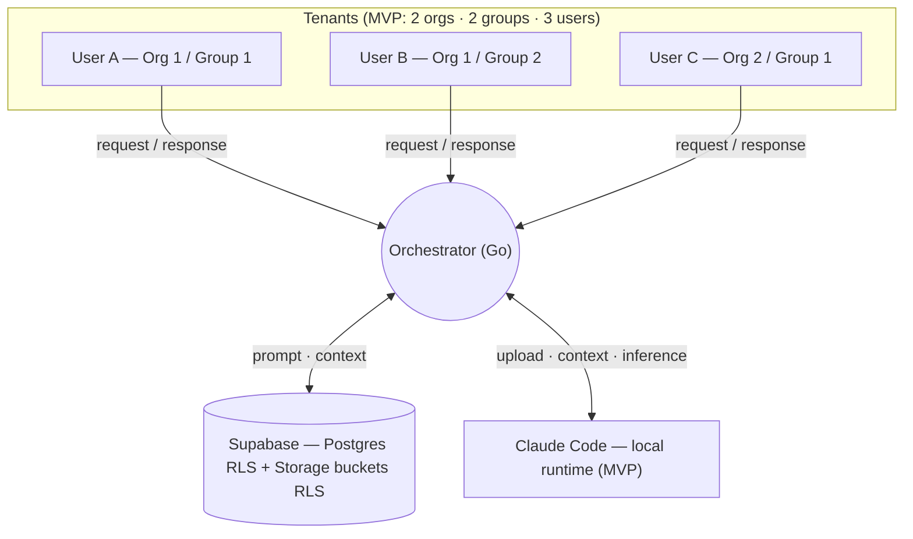

# Houston 2.0 — Context (What, Why & How)

> A platform to host AI agents in a multi-tenant setup. A single orchestrator serves 1..N
> agents for multiple organizations, guaranteeing that no organization can access another's
> data, while agents within the same organization share a structured common knowledge base.
>
> This single document is the **what**, the **why**, and the **how**. Part I is the what/why,
> Part II is the how (MVP), and the Appendix records post-MVP exploration.
>
> **Built on Houston, not instead of it.** Houston (the reference implementation,
> https://github.com/gethouston/houston) is **single-tenant and local-first** — its engine has
> no `org_id`/tenant concept and its `teams/` + `cloud/` products are unbuilt README stubs. So
> the **multi-tenant control plane is ours to build**, but the **agent format, the
> provider/runtime plumbing, and the user-identity login already exist in Houston and are reused
> as-is.** The reuse-vs-build seam is the first thing in Part II (§0).

---

# Part I — What & Why

## What we're building (MVP first)

The first deliverable is an **isolation demo**: the platform running for multiple
organizations and groups at once, proving that tenants are fully isolated and showing how the
design generalizes to **N orgs / N groups / N users**.

**First cut:** 2 organizations · 2 groups · 3 users.

Two tenant-isolated use cases are in scope:

1. **Create an agent** — blank, from a shared **template** (e.g. a sales agent), AI-assisted,
   or imported from GitHub. Every new agent is written scoped to the creator's org + group,
   isolated from other tenants from birth.
2. **Run an agent** — a request (prompt + optional files) is answered by an agent that only
   ever sees its own org + group context.

For the MVP this runs **locally** (no VPS): a **Go orchestrator**, **Supabase** (Postgres +
Storage, both with Row-Level Security) as the data layer, and **Claude Code in the local
terminal** as the runtime. See Part II for the flows and diagrams.

## Why

1. **Isolation is first-class, not an afterthought.** Every piece of data is born associated
   with an organization and a group. There is no ownerless data.
2. **Isolation is enforced by the data layer, not just the application.** Even if a bug lets a
   malformed query through, the storage layer must not return another organization's data.
   RLS in Postgres **and** Storage is the hard guarantee.
3. **An agent is a configuration, not a process.** Creating an agent means registering a
   definition in Supabase, not spinning up a machine.
4. **Shared knowledge is explicit.** Common knowledge is a declared category (`general` /
   group) with clear rules about who can read it.
5. **The MVP proves it.** Success = a test that fails the moment isolation breaks (see below).
6. **Build on Houston, don't reinvent it.** The multi-tenant layer (identity→org/group,
   RLS, orchestration) is ours because Houston lacks it entirely. Everything *below* that line
   — the agent file format, the provider CLIs/adapters, the BYOA OAuth relay, the in-instance
   hydration helpers, and the **user-identity login (Supabase + Google SSO)** — is reused from
   Houston rather than rebuilt. The exact reuse map is Part II §0.

## High-level picture



## Domain model

| Concept | Description |
|---|---|
| **Organization** | The tenant. The unit of isolation. |
| **Group** | A subdivision within an org. There is always a special `general` group plus any number of functional groups (e.g. `developers`, `sales`). |
| **Agent** | An agent instance: identity, instructions, configuration. Belongs to one org and one group. |
| **Template** | A reusable agent blueprint in a **shared, read-only catalog** (e.g. a sales agent). Instantiated *into* an org/group, where the resulting agent is tenant-isolated. |
| **Knowledge / files** | Documents, skills, scripts associated with an org + group, stored in Supabase Storage buckets. |
| **Membership** | The relationship between a user and the org + group they belong to. Defines what they can see. |
| **Prompt / Conversation** | A request and its interaction history with an agent. |

## The isolation model

The central rule of the entire system:

```
An agent in group G, inside organization O, can read data where:

    organization = O   AND   group ∈ { general, G }

It can never read anything from another organization.
```
