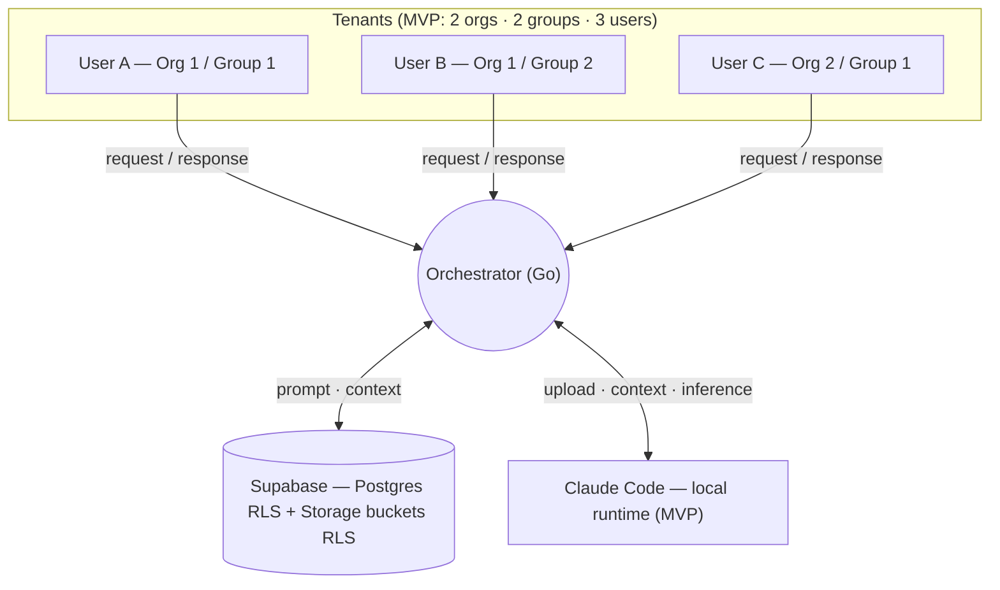
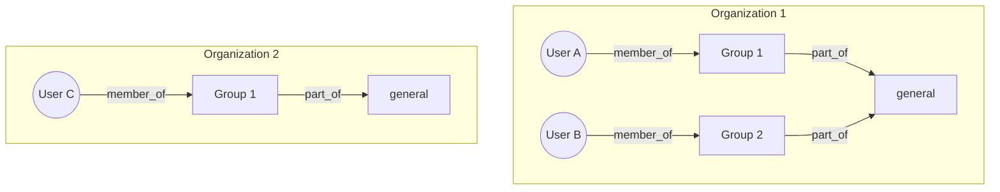
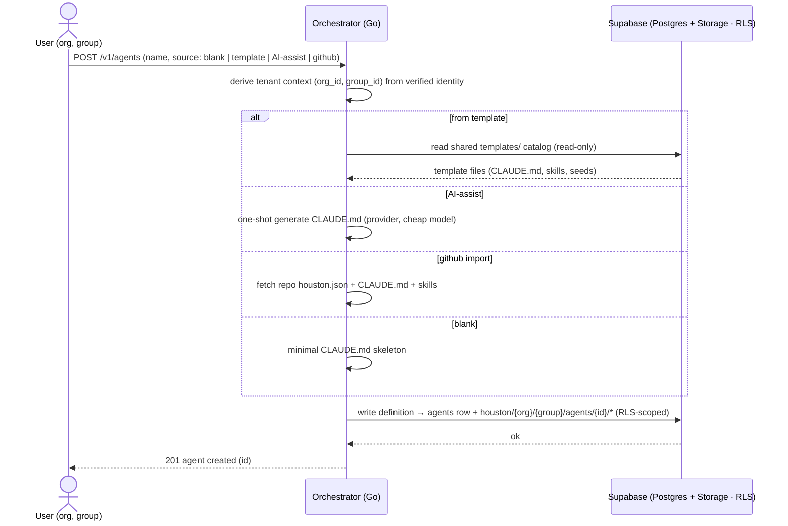
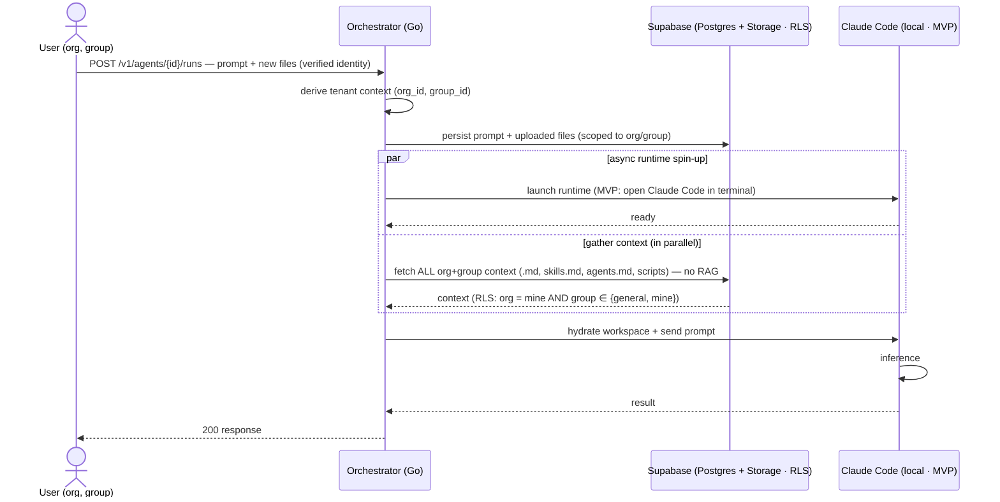

# Houston 2.0 — Context (What, Why & How)

> A platform to host AI agents in a multi-tenant setup. A single orchestrator serves 1..N
> agents for multiple organizations, guaranteeing that no organization can access another's
> data, while agents within the same organization share a structured common knowledge base.
>
> This single document is the **what**, the **why**, and the **how**. Part I is the what/why,
> Part II is the how (MVP), and the Appendix records post-MVP exploration.
>
> **Built on Houston, not instead of it.** Houston (the reference implementation,
> https://github.com/gethouston/houston) is **single-tenant and local-first** — its engine has
> no `org_id`/tenant concept and its `teams/` + `cloud/` products are unbuilt README stubs. So
> the **multi-tenant control plane is ours to build**, but the **agent format, the
> provider/runtime plumbing, and the user-identity login already exist in Houston and are reused
> as-is.** The reuse-vs-build seam is the first thing in Part II (§0).

---

# Part I — What & Why

## What we're building (MVP first)

The first deliverable is an **isolation demo**: the platform running for multiple
organizations and groups at once, proving that tenants are fully isolated and showing how the
design generalizes to **N orgs / N groups / N users**.

**First cut:** 2 organizations · 2 groups · 3 users.

Two tenant-isolated use cases are in scope:

1. **Create an agent** — blank, from a shared **template** (e.g. a sales agent), AI-assisted,
   or imported from GitHub. Every new agent is written scoped to the creator's org + group,
   isolated from other tenants from birth.
2. **Run an agent** — a request (prompt + optional files) is answered by an agent that only
   ever sees its own org + group context.

For the MVP this runs **locally** (no VPS): a **Go orchestrator**, **Supabase** (Postgres +
Storage, both with Row-Level Security) as the data layer, and **Claude Code in the local
terminal** as the runtime. See Part II for the flows and diagrams.

## Why

1. **Isolation is first-class, not an afterthought.** Every piece of data is born associated
   with an organization and a group. There is no ownerless data.
2. **Isolation is enforced by the data layer, not just the application.** Even if a bug lets a
   malformed query through, the storage layer must not return another organization's data.
   RLS in Postgres **and** Storage is the hard guarantee.
3. **An agent is a configuration, not a process.** Creating an agent means registering a
   definition in Supabase, not spinning up a machine.
4. **Shared knowledge is explicit.** Common knowledge is a declared category (`general` /
   group) with clear rules about who can read it.
5. **The MVP proves it.** Success = a test that fails the moment isolation breaks (see below).
6. **Build on Houston, don't reinvent it.** The multi-tenant layer (identity→org/group,
   RLS, orchestration) is ours because Houston lacks it entirely. Everything *below* that line
   — the agent file format, the provider CLIs/adapters, the BYOA OAuth relay, the in-instance
   hydration helpers, and the **user-identity login (Supabase + Google SSO)** — is reused from
   Houston rather than rebuilt. The exact reuse map is Part II §0.

## High-level picture



## Domain model

| Concept | Description |
|---|---|
| **Organization** | The tenant. The unit of isolation. |
| **Group** | A subdivision within an org. There is always a special `general` group plus any number of functional groups (e.g. `developers`, `sales`). |
| **Agent** | An agent instance: identity, instructions, configuration. Belongs to one org and one group. |
| **Template** | A reusable agent blueprint in a **shared, read-only catalog** (e.g. a sales agent). Instantiated *into* an org/group, where the resulting agent is tenant-isolated. |
| **Knowledge / files** | Documents, skills, scripts associated with an org + group, stored in Supabase Storage buckets. |
| **Membership** | The relationship between a user and the org + group they belong to. Defines what they can see. |
| **Prompt / Conversation** | A request and its interaction history with an agent. |

## The isolation model

The central rule of the entire system:

```
An agent in group G, inside organization O, can read data where:

    organization = O   AND   group ∈ { general, G }

It can never read anything from another organization.
```

- **Across organizations:** total isolation. No exceptions, no admin mode that crosses the
  boundary.
- **Within an organization:** `general` knowledge is visible to all agents in the org; group
  knowledge is visible only to that group; two groups cannot see each other (except via
  `general`).
- **Templates** are the one shared, cross-tenant artifact — but they are **read-only**, and
  once instantiated the resulting agent is fully org/group-scoped.

### Permissions as a graph

The rule above is the **base case** — a tree (`org → group → agent`). The full model is a
**graph**: users, groups, orgs and agents are nodes; membership and ownership are edges; and
**controlled sharing** (one group lending context to another, a firm sharing with a client
org) is an explicit edge an admin creates. The isolation invariant: **no path crosses an
organization boundary unless such an edge exists.** The MVP enforces the base tree (no share
edges) and the leak test proves it; the share edges are the documented path to N-org / N-group
sharing (mechanism in §2.1).

Concrete MVP instance (2 orgs · 2 groups · 3 users) — no edge crosses Org 1 ↔ Org 2, so
isolation holds *by construction*:



- **User A** reads `Org1/general` + `Org1/Group 1` — never `Org1/Group 2`, never `Org2/*`.
- **User B** reads `Org1/general` + `Org1/Group 2` — never `Org1/Group 1`, never `Org2/*`.
- **User C** reads `Org2/general` + `Org2/Group 1` — never anything in `Org1`.

## MVP scope & the leak test

**Scope:** 2 organizations, 2 groups, 3 users.

**The proof — the leak test.** Seed data for Org A and Org B (with their groups), act as a
user in Org A / Group 1, and assert that **not a single row and not a single Storage object**
from Org B — or from another non-`general` group of Org A — is returned. If isolation breaks,
this test fails. This is the acceptance gate for the MVP.

## Roadmap

- **Milestone 1 — the isolation cut (MVP, local).** Data model with org + group on every unit;
  RLS in Postgres and Storage; create-agent and run-agent flows; the leak test passes. Runs
  locally with the Go orchestrator + Supabase + Claude Code. Reuses Houston's user-identity
  login and agent format (§0).
- **Post-MVP — operations & scale.** Managed/ephemeral cloud hosting, retrieval (pgvector
  semantic search), per-tenant observability and usage limits, horizontal scale. Options and
  research are recorded in the Appendix.

## Out of scope (for now)

- A specific end-user interface (desktop, mobile, web).
- Real billing integration (provider accounts cover AI spend; see Appendix C — BYOA).
- Cloud/ephemeral hosting and hardware-level isolation (post-MVP).
- Retrieval optimization / semantic search — the MVP sends all org+group context.
- **WebSocket / live token streaming** — the MVP is HTTP request→response only (§0, Transport).

---

# Part II — How (MVP)

The MVP's job is to **prove data isolation** between users, organizations, and groups, and to
show how the flow generalizes to N orgs / N groups / N users.

**MVP shape (decided):** no VPS, runs **local**; a **Go orchestrator**; **Supabase** as the
data layer (**Postgres + RLS** for identity/agents/prompts, **Storage buckets + RLS** for
agent files); and **Claude Code in the local terminal** as the runtime. **HTTP only** (no
WebSocket — §0). No semantic search/RAG yet — the orchestrator gathers and sends *all* of a
tenant's org+group context. Cloud hosting, ephemeral sandboxes, billing, and the full
hydrate/sync agent lifecycle are **deferred to the Appendix**.

## 0. Compatibility with Houston — what we reuse vs build

Houston is single-tenant and local-first. Verified against the source: its 15 engine crates
carry **no** `org_id`/`tenant` concept; its identity plumbing notes *"server-side use is future
work"* and the event envelope *"does NOT carry user_id today"*; and `teams/` + `cloud/` are
single-file `README` stubs. So multi-tenancy is **ours to build** — but as a *control plane
around* Houston's artifacts, never a fork of them. The seam:

```
┌─────────────────────────────────────────────────────────────┐
│  CONTROL PLANE  — WE BUILD            (what Houston lacks)    │
│  Go orchestrator · identity → org/group · Postgres+Storage   │
│  RLS · hydrate → run → sync · the leak test                  │
├─────────────────────────────────────────────────────────────┤
│  FORMAT + RUNTIME  — REUSE FROM HOUSTON  (what it does well)  │
│  houston.json / CLAUDE.md / .houston/ layout                 │
│  user-identity login (Supabase Auth + Google SSO, PKCE)      │
│  provider adapters (Claude / Codex / Gemini)                 │
│  login_relay.rs  (BYOA provider OAuth — Appendix C)          │
│  seed_agent · build_agent_context · learnings sanitization   │
└─────────────────────────────────────────────────────────────┘
```

| Concern | Source | Decision |
|---|---|---|
| **User identity / login** | **Reuse Houston** — Supabase Auth + Google SSO (PKCE) | Same Supabase project + Google provider config. Houston proves *who the user is*; we add org/group on top. See Appendix C + §2. |
| **Org / group / membership / RLS** | **We build** | Houston has **no tenancy at all**. This is the core of the MVP. |
| **Agent definition format** | **Reuse Houston** — `houston.json` + `CLAUDE.md` + `.houston/` | Hydrated into the run dir; keeps GitHub-import and templates compatible. |
| **In-instance runtime helpers** | **Reuse Houston** — `seed_agent`, `build_agent_context`, learnings anti-injection | Run as-is inside the Claude Code working dir (Appendix D). |
| **Provider BYOA login relay** | **Reuse Houston** — `login_relay.rs` | Invoke as subprocess; do **not** rewrite in Go (Appendix C). |
| **Wire protocol shape** | **Mirror Houston** — `/v1/*` REST | HTTP for the MVP; WS deferred (Transport, below). |
| **Multi-tenant engine process** | **N/A in Houston** | Houston runs one engine per desktop user. We orchestrate a run per request instead. |

### Transport — HTTP now, WebSocket later

Houston speaks **HTTP + WebSocket**: HTTP for resource REST under `/v1/*`, WebSocket at
`/v1/ws` for live token streaming and server-push events. For the **2-day isolation MVP we use
HTTP only** — `create-agent` and `run-agent` are request → response, which is all that is
needed to *prove isolation*; there is no live UI to stream tokens to. We deliberately **shape
the routes like Houston's `/v1/*`** so that adding the WS channel later (token streaming once a
real frontend exists) is **additive, not a rewrite**. WebSocket is **not required** to
demonstrate tenant isolation and is out of MVP scope.

### Reuse caveat (be precise)

Reusing Houston's login means reusing its **authentication** (Supabase Auth + Google SSO PKCE
flow, `knowledge-base/auth.md`) — *not* an authorization model: Houston identifies a **single
desktop user** and has no org/group/membership notion. So we reuse the "who are you" half and
**build** the "which org/group, and what may you read" half (memberships + RLS, §2). Likewise,
Houston's auth callback is a Tauri deep link (`houston://auth-callback`); the local MVP uses a
standard web/loopback redirect against the **same** Supabase project + Google provider — the
Supabase setup transfers, the desktop deep-link plumbing does not.

## 1. MVP use cases & flows (the spine)

Two tenant-isolated use cases, both in the MVP: **(a) create an agent** and **(b) run an agent
(request → inference)**. Shared MVP simplifications:

- **Runtime** = Go orchestrator opening **Claude Code in the local terminal** (subprocess),
  launched **asynchronously**.
- **Transport** = **HTTP only**, routes shaped like Houston's `/v1/*` (§0). No WebSocket.
- **Storage** = Supabase **Storage buckets + RLS** for agent files; **Postgres + RLS** for
  identity, agents, and prompts.
- **No RAG** — gather and send *all* org+group context.
- **Scope** 3 users / 2 orgs / 2 groups; **goal** = prove isolation + show N-generalization.

### 1.1 Agent creation (write path)

The creation paths converge on one thing — **persist an agent definition to Supabase, scoped to
org/group** (an `agents` row + objects under `houston/{org_id}/{group_id}/agents/{agent_id}/`).
The MVP supports the Houston sources: **blank**, **from template** (the shared catalog, §2),
**AI-assist** (one-shot `CLAUDE.md` generation via the provider), and **GitHub import** (fetch a
repo's `houston.json` + files). The created agent is **tenant-isolated from birth**. The file
shapes (`houston.json`, `CLAUDE.md`, `.houston/`) are Houston's, reused verbatim (§0).



### 1.2 Run an agent (request → inference)

The detailed async flow. MVP simplifications above apply. Transport is plain HTTP: the client
POSTs the request and receives the result on the same response (no streaming).



> The `par … and … end` block is what "async" means here: the orchestrator does **not** block
> on the (slow) runtime boot — it launches Claude Code and, in parallel, fetches the org+group
> context from Supabase. Only when both branches complete does it send the prompt. (Streaming
> that result token-by-token is the WebSocket upgrade deferred in §0.)

## 2. Data model & isolation (MVP)

Supabase is where the *"isolation enforced by the data layer"* principle becomes concrete.

**Identity reuse.** Authentication is Houston's Supabase Auth + Google SSO (PKCE, §0). On top of
the authenticated `auth.users` row we add the tenancy tables below; the request's `(org_id,
group_id)` is derived from the user's `memberships`, not trusted from the client.

**Postgres tables** (every tenant row carries `org_id` + `group_id`):

- `organizations` — the tenant / unit of isolation.
- `groups` — subdivisions of an org, including a special `general` group per org.
- `memberships` — `user → org + group (+ role)`; the source of a request's tenant context.
- `agents` — the agent definition records (id, name, config, `org_id`, `group_id`).
- `prompts` / `conversations` — request + interaction history.

**RLS** is keyed on the requesting user's membership. **Decision (MVP):** derive
`(org_id, group_id)` via a `security definer` helper that **joins `memberships`** rather than
trusting JWT claims — one source of truth, and a user who belongs to multiple groups or switches
group does not require a token refresh. The policy enforces the central rule:

```
org = mine  AND  group ∈ { general, mine }
```

Even a malformed query cannot return another org's rows — RLS filters before results return.

**Storage bucket layout** — agent files live in buckets under per-tenant path prefixes:

```
houston/{org_id}/{group_id}/agents/{agent_id}/...   ← group-scoped agent files
houston/{org_id}/general/...                         ← org-wide (general) layer
templates/...                                        ← shared catalog (NOT tenant-scoped)
```

**Storage RLS policies** mirror the same `org = mine AND group ∈ {general, mine}` rule for the
tenant prefixes.

**Templates / store (shared catalog).** Houston's bundled agent templates (e.g. a
`sales`/`ventas` agent) live in Supabase as a **global, read-only catalog** — a `templates`
table + a `templates/` bucket prefix that is **not** tenant-scoped (read by everyone).
**Instantiating** a template **copies** its files (`CLAUDE.md`, skills, seeds) into the
requesting org/group prefix, where it becomes a normal tenant-isolated agent.
**Isolation nuance:** templates are shared read-only; agent *instances* are org/group-scoped.
The MVP seeds at least one template (e.g. sales) to demonstrate this.

**The leak test (acceptance gate).** Seed 2 orgs / 2 groups / 3 users; act as User A
(Org1/Group1); assert that **no rows and no bucket objects** from Org2 or from Org1/Group2 are
returned (the `general` layer of the user's own org excepted). This test failing = isolation
broke.

### 2.1 Permissions as a graph

The base rule above is a **tree**: `org → group → agent`, with the fixed reachability
`org = mine AND group ∈ { general, mine }`. The MVP enforces exactly this tree, and the leak
test proves it (the concrete 2-org / 2-group / 3-user graph is drawn in Part I). But "manage
permissions for N orgs / N groups / N users" — and the eventual need for **controlled sharing**
(one group lending context to another, or a firm sharing a template with a client org) — is
naturally a **graph**, not a tree.

**Model.** Nodes are `users`, `groups`, `orgs`, `agents`; edges are the membership/ownership
relations plus explicit, admin-granted **share edges**. A user may read a resource iff a path
exists under the visibility rule — and **no path crosses an org boundary unless an explicit
share edge was created by an admin of the source.**

**The share edge (the graph generalization).** Controlled sharing is one extra table — the
edges of the graph — plus one extra `OR` branch in the policy. The common case stays
join-free:

```sql
CREATE TABLE context_shares (
  id          uuid PRIMARY KEY DEFAULT gen_random_uuid(),
  source_type text NOT NULL CHECK (source_type IN ('org','group','agent')),
  source_id   uuid NOT NULL,
  target_type text NOT NULL CHECK (target_type IN ('org','group','agent')),
  target_id   uuid NOT NULL,
  permission  text NOT NULL DEFAULT 'read' CHECK (permission IN ('read','write')),
  created_by  uuid REFERENCES auth.users(id),   -- must be an admin of `source`
  created_at  timestamptz DEFAULT now(),
  UNIQUE (source_id, target_id)
);

-- Visibility = base tree rule  OR  an explicit inbound share edge.
CREATE POLICY context_visibility ON contexts FOR SELECT USING (
     ( org_id = (auth.jwt()->>'org_id')::uuid
       AND group_id IN ((auth.jwt()->>'group_id')::uuid, 'general'::uuid) )
  OR id IN (
       SELECT source_id FROM context_shares
       WHERE target_id IN ((auth.jwt()->>'group_id')::uuid, (auth.jwt()->>'org_id')::uuid)
     )
);
```

`context_shares` is itself RLS-protected: only an admin of the **source** entity may create an
edge. **MVP note:** the MVP ships and tests only the **base tree rule** (no share rows) — the
share-edge mechanism is documented here as the deliberate path to controlled sharing and is
exercised post-MVP. Keep the `org_id`/`group_id` columns simple in the MVP schema; do not let
the graph generalization leak into the base tables early.

## 3. Context hydration (MVP)

How the orchestrator assembles what Claude Code receives:

1. List + download **all** objects under the tenant's bucket prefixes — the user's group
   (`houston/{org}/{group}/...`) plus the org's `general` layer (`houston/{org}/general/...`).
2. Drop them into the Claude Code working directory (`.md`, `skills.md`, `agents.md`, scripts,
   json — the same `.houston/` file shapes Houston uses; Houston's `seed_agent` /
   `build_agent_context` run in-instance, reused as-is, Appendix D).
3. Send the prompt.

**MVP = send everything** — no selection, no embeddings, no semantic search. This is **known,
accepted tech debt** for the 2-day MVP: correctness (isolation) ships first; retrieval
efficiency (pgvector semantic search scoped to `{general, group}`) is a later fix, recorded in
the Appendix. The decision is deliberate, not an oversight.

Creating an agent **from a template** copies the shared `templates/` files into the tenant
prefix first (§2); from then on hydration reads only the tenant's own org/group objects.

## 4. Local dev / running the MVP

What it takes to run the MVP locally:

- The **Go orchestrator** process (HTTP entrypoint, routes shaped like Houston `/v1/*`, for
  create-agent and run-agent).
- The **`claude` CLI** installed and authenticated (the local runtime).
- **Supabase** — local CLI or a cloud project — with the schema, buckets, and **RLS policies**
  applied, the `templates` catalog seeded, **and Google SSO configured** (reused from Houston's
  auth setup, §0).
- **Seed fixture** — the 2-org / 2-group / 3-user data used by the leak test.

There is no cloud/sandbox provisioning in the MVP: "spin up the machine" = open Claude Code in
a local terminal.

---

# Appendix — Post-MVP / exploration

> The MVP fixes two things deliberately: **runtime = local Claude Code** and **storage = Supabase
> buckets**. This appendix records the longer-term options and the research behind them. They
> are **not** part of the MVP.

## A. Runtime options (not yet decided for post-MVP)

How the agent loop runs once we leave the local terminal.

- **Option A — Claude Agent SDK (headless).** Same agentic loop/tools as Claude Code, run
  non-interactively (`-p` / `query()`). **Cross-host fact:** persist
  `~/.claude/projects/<encoded-cwd>/<session-id>.jsonl` and restore it before `resume` →
  `~/.claude` becomes a hydrated artifact stored in Supabase. Best for Claude-native behavior
  with least custom plumbing. Docs: code.claude.com/docs/en/headless,
  platform.claude.com/docs/en/agent-sdk/{sessions,hosting}.
- **Option B — Vercel AI SDK (Agent abstraction).** TypeScript, Claude as a provider, strong
  frontend streaming. Best if web-first; lighter agent layer (we own more of the loop).
- **Option C — Go-native loop on the Anthropic Messages API.** Single-language stack, max
  control, but we rebuild tools/skills/memory ourselves.

**Lean:** Option A preserves the stateless-engine model with least plumbing, and the BYOA
billing model (Appendix C) reinforces it (it requires running the provider CLI / Agent SDK to
perform the user's own OAuth; a pure API-key loop, Option C, does not).

## B. Hosting / sandbox candidates (post-MVP, founder's set; not AWS)

> **NOT IN THE MVP.** The MVP runs **local** (Claude Code in a terminal) — no sandbox, no VPS.
> This table is **post-MVP research only**. Do not pick a platform until the local
> single-run model works and there is a real need to leave the terminal. Recorded here so the
> decision is informed when it arrives.

| Platform | Isolation | Cold start | Price (≈) | GPU | Scale-to-zero | Notes |
|---|---|---|---|---|---|---|
| **E2B** | Firecracker microVM, dedicated kernel (strongest) | ~150 ms | $0.0504 / vCPU-hr; Hobby $100 credit, 20 concurrent | No | Yes | Strongest per-tenant boundary; large template catalog |
| **Daytona** | Container default; optional Kata/Sysbox ≈ microVM | ~27–90 ms (fastest) | $0.0504 / vCPU-hr | No | Yes | Best when per-turn cold-start latency dominates |
| **Modal** | gVisor | — | ≈ $0.071 / vCPU-hr; 50k+ concurrent | **Yes (in-sandbox)** | Yes | Only option with a GPU *inside* the sandbox |
| **Railway** | Container PaaS | — | per-service | No | No (per service) | Great DX; weaker per-session isolation |
| **Google Cloud — Cloud Run** | gVisor containers, scale-to-zero | — | per-request / CPU | Yes | Yes | GCP-native baseline |
| **Lambda(s)** | — | — | — | depends | — | **Ambiguous:** *AWS Lambda* (excluded) vs *Lambda Labs* (GPU cloud, not a per-session sandbox). Confirm intent. |

**Lean:** E2B for strongest isolation; Daytona if cold-start latency dominates; Modal only if
GPU work happens sandbox-side; Cloud Run as the GCP-native baseline. Figures are May 2026
research — re-verify (pricing drifts).

**Warm pool (latency).** Whichever platform we pick, a small pool of pre-booted, *unassigned*
instances kept ready (then bound to a tenant at request time and torn down after) hides
cold-start latency without sacrificing per-tenant isolation. Pool sizing is a post-MVP tuning
knob.

## C. Provider accounts & billing — Bring Your Own Account (BYOA)

Mirrors how [Houston](https://github.com/gethouston/houston) does it today.

**Principle.** No platform-wide AI API keys, no token reselling. Each org/user **connects
their own provider account** (Anthropic / OpenAI / Google); AI usage is billed by the provider
**directly to that account**. This resolves the *cost isolation* question for AI spend: the
billing boundary is the provider account itself, per tenant.

**Reuse note (login).** There are **two distinct logins**, and both come from Houston:
**(A) Houston user identity** — Supabase Auth + Google SSO (PKCE). **Reused directly** (§0): it
proves *who the user is*, but carries **no org/group** — Houston's engine has no server-side
`user_id`/tenant model — so we layer membership → (org, group) + RLS on top (§2).
**(B) provider / "service account"** — the provider CLI OAuth, orchestrated headless; "billing
login" = B. This is Houston's `login_relay.rs`, **invoked, not rewritten**.

**Headless relay.** The control plane launches the provider CLI as a subprocess (stdin/stdout
piped), reads stdout line-by-line, strips ANSI, extracts the first HTTPS login URL → emits to
the client. The user authorizes and either **pastes back** a code (Claude) or uses a
**device-code** the CLI prints (Codex `--device-auth`). On success the CLI writes its
credentials file; completion is reported back. (In the HTTP-only MVP this is a poll/redirect
exchange; the WS push channel for live relay status is the §0 upgrade.)

| Provider | Connect command | Flow | Credentials file |
|---|---|---|---|
| **Anthropic / Claude** | `claude auth login --claudeai` | paste-back | `~/.claude/.credentials.json` |
| **OpenAI / Codex** | `codex login --device-auth -c ...` | device-code | `~/.codex/auth.json` |
| **Google / Gemini** | JSON-RPC `authenticate` over `--acp`, or API key | browser / key | `~/.gemini/oauth_creds.json` or `~/.gemini/.env` |

**Fit with the hydrated model.** The credentials file is per-org/user hydrated state stored
encrypted in Supabase, scoped to one tenant, hydrated into the instance at start, synced back
on refresh. The connect/login relay is a control-plane provisioning step (the Go orchestrator
plays the role Houston's Rust `engine-core` does). **Isolation:** a compromised instance cannot
spend another org's provider account.

## D. Full agent lifecycle — hydrate → run → sync (post-MVP)

In Houston an agent **is a folder on local disk** and the filesystem is the source of truth
(`agents_crud::create()` writes it; `build_agent_context()` re-injects state files at every
`sessions::start`). Post-MVP we keep the reframe the MVP already uses — **Supabase is the
source of truth; the instance disk is a throwaway working copy** — and add **sync-back** of
mutated state so personalization survives teardown.

**Artifact mapping (Houston disk → Supabase):**

| Houston artifact | Nature | Houston 2.0 home |
|---|---|---|
| `.houston/agent.json` (id, config, color, ts) | definition | `agents` row + `org_id`, `group_id` |
| `CLAUDE.md` — instructions | definition | agent definition (Postgres column or Storage object) |
| `CLAUDE.md` — `## Learnings` | mutable state | synced back each session |
| `.agents/skills/` | versioned definition | Storage, per-org prefix (or `skills` table) |
| seeds: `outputs.json`, `routines.json`, … | initial state | written at creation, then mutable |
| `learnings.json`, `integrations.json` | mutable state | per-agent state, hydrated/synced |
| `config/context-ledger.json` | mutable knowledge | candidate for the org/group knowledge layer + pgvector |
| `activity.json`, `routine_runs` | append-only log | per-agent state table |
| `agent-schemas` JSON Schemas | static contract | embedded at build — not per-tenant |
| `AGENTS.md` / `GEMINI.md` symlinks | derived | recreated in-instance by `seed_agent()` |

**Reuse:** Houston's in-instance logic (`seed_agent`, `build_agent_context`, the learnings/
skills assembly) is reused **as-is**; we only add a hydrate-before / sync-after wrapper. The
learnings **anti-injection** sanitization (`learnings_context.rs`: drop "ignore previous
instructions"-style entries, strip control chars, cap ~4 000 chars) runs in-instance — keep it.

### D.1 Event sourcing — immutable context history (post-MVP)

Houston's mutations are destructive (`learnings.json` overwritten, `context-ledger.json`
replaced). For an enterprise multi-tenant platform we likely want an append-only log instead:
every context mutation becomes an immutable event (`context_events`: `org_id`, `group_id`,
`agent_id`, `event_type`, `payload jsonb`, `actor_id`, `session_id`), RLS-scoped like every
other table.

| Capability | How |
|---|---|
| **Rollback** | Replay events up to a timestamp to reconstruct agent state. |
| **Audit trail** | Who changed what, when, in which session — enterprise compliance. |
| **Cross-agent reactivity** | Agent B subscribes to Agent A's context-change stream. |
| **Conflict resolution** | Concurrent sessions (see §E) merge event streams instead of last-writer-wins on whole files. |

In the hydrate → sync cycle: **sync-back emits a diff event per change** instead of
overwriting; periodic **snapshots** compact the log so hydration doesn't replay everything.
The in-instance anti-injection sanitization is unchanged. **Highest over-engineering risk in
this appendix — do not pull into the MVP; the MVP overwrites.**

## E. Open decisions / next steps

- **Runtime pick** (Appendix A): A / B / C — for post-MVP, once we leave the local terminal.
- **Hosting pick** (Appendix B): E2B / Daytona / Modal / Cloud Run / Railway — resolve the
  "Lambda(s)" ambiguity. (Explicitly **out of the MVP** — local only.)
- **Transport** (§0): HTTP-only for the MVP; add WebSocket `/v1/ws` when a real frontend needs
  live token streaming. Decided.
- **Login** (§0 + Appendix C): reuse Houston's Supabase + Google SSO for user identity; reuse
  `login_relay.rs` for provider BYOA. Decided.
- **Cost isolation:** AI spend resolved by BYOA (Appendix C). Open: *compute* cost isolation
  (shared ephemeral vs dedicated per tenant).
- **Groups:** controlled list per org, or free-form labels?
- **Controlled sharing (graph, §2.1):** when to enable `context_shares` edges; who may grant
  them; are cross-org shares allowed, or group-to-group within an org only? (MVP = base tree
  rule, no shares.)
- **Context history (§D.1):** adopt event sourcing for audit/rollback/cross-agent reactivity,
  or keep simple file overwrite? (MVP = overwrite.)
- **Agent storage shape:** MVP uses **Storage objects** (buckets). Post-MVP, consider
  normalizing definition + state into Postgres (queryable, RLS-granular) — likely hybrid.
- **Sync timing** (post-MVP): end-of-session vs write-through.
- **Session concurrency:** Houston assumes one writer per agent folder; multi-tenant may run
  concurrent sessions → lock / last-writer-wins / session fork.
- **Retrieval:** MVP sends all context (accepted tech debt); post-MVP add pgvector semantic
  search scoped to `{ general, group }`.

## F. Resources

**Reference implementation (Houston today)** — https://github.com/gethouston/houston
(user-identity login `knowledge-base/auth.md` + `app/src-tauri/src/auth.rs`; provider relay
`engine/houston-engine-core/src/provider/login_relay.rs`; adapters
`engine/houston-terminal-manager/src/provider/{anthropic,openai,gemini}.rs`; REST
`engine/houston-engine-server/src/routes/providers.rs`; wire protocol
`knowledge-base/engine-protocol.md`; agent creation
`engine/houston-engine-core/src/agents_crud.rs`).

**Runtime** — code.claude.com/docs/en/headless ·
platform.claude.com/docs/en/agent-sdk/sessions · platform.claude.com/docs/en/agent-sdk/hosting ·
ai-sdk.dev · vercel.com/docs/agent-resources/coding-agents/claude-code ·
platform.claude.com/docs/en/api/overview

**Hosting** — startuphub.ai/.../daytona-vs-e2b-vs-modal-vs-vercel-sandbox-2026 ·
superagent.sh/blog/ai-code-sandbox-benchmark-2026 ·
northflank.com/blog/daytona-vs-e2b-ai-code-execution-sandboxes ·
northflank.com/blog/ai-sandbox-pricing · northflank.com/blog/best-agent-cloud-platforms

**Supabase** — supabase.com/docs/guides/database/postgres/row-level-security ·
supabase.com/docs/guides/ai (pgvector) ·
supabase.com/docs/guides/storage/security/access-control ·
supabase.com/docs/guides/auth/social-login/auth-google

> Hosting/runtime figures are May 2026 web research — re-verify before any platform commitment.
